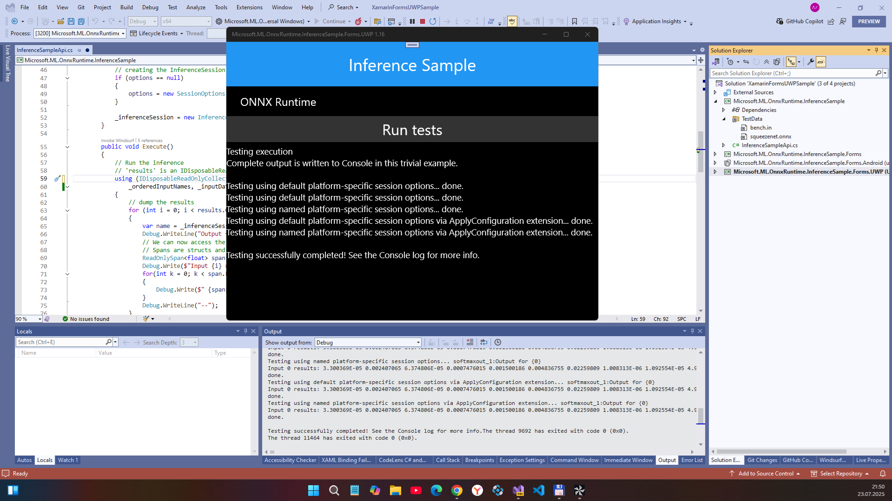

# onnxruntime 1.22 - main branch

About
My fork of ONNX Runtime 1.16 for some own purposes. "Xamarin Forms's UWP". Proof-of-Concept

## My 2 cents 
- I sucessfully added UWP to Xamarin Forms sample). 
- onnxruntime lib src code removed (see original if you interested in huge and hard src build journay...)

## Screenshot

## Status

 UWP target tech. details : 

 - TargetPlatformIdentifier: UAP (UWP)
 - TargetPlatformVersion: 10.0.19041.0
 - TargetPlatformMinVersion: 10.0.16299.0
 - PackageReference 1: Xamarin.Forms v3.6.0.709228 
 - PackageReference 2: Microsoft.NETCore.UniversalWindowsPlatform v6.2.8
 - PackageReference 3: Microsoft.ML.OnnxRuntime v1.22.1
 - PackageReference 4: Xamarin.Essentials v1.7.0 (optional)
 - SDKReference 1: WindowsMobile v10.0.16299.0 (Windows Mobile Extensions for the UWP %28WindowsMobile, Version=10.0.16299.0)  
 - SDKReference 2: WindowsMobile v10.0.19041.0 (Windows Mobile Extensions for the UWP %28WindowsMobile, Version=10.0.19041.0)

## Conclusion
- I hope this thing may be compatible with W10M 15063 after some "16299-15063" _magic_

## References
- https://github.com/microsoft/onnxruntime ONNX Runtime: cross-platform, high performance ML inferencing and training accelerator

## ..
AS IS. RnD only. No support. DIY

## .
[m][e] 2025
